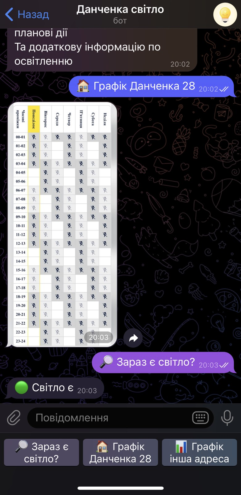

<h1 align="center">Hi there, I'm <a href="https://www.linkedin.com/in/vitalii-hoshchenko/" target="_blank">Vitalii</a> 
</h1>
<h3 align="center">Junior Python developer. And this is Данченка Світло Telegram Bot</h3>

It`s simpe telegram bot with some specifics:
- After /start command user is saved to small db build with sqlite3
- Main func ping routers IP and when response changed send message to all users in db
- CI/CD is integrated. After git push command it:
  * Build Docker image
  * Push container to DigitalOcean Container Registry
  * Deploy to Digital Ocean droplet via SSH action

    
   

